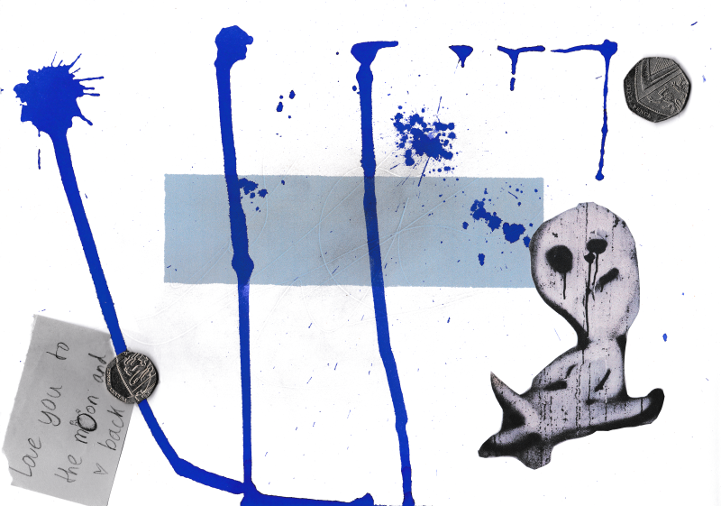

Estas cinco imágenes son el componente visual de la obra de arte interdisciplinaria "Five Stages of Healing" sobre el proceso de sanación emocional. El punto de partida es el final de una relación amorosa y la exploración de las cinco etapas del duelo, basadas en el modelo de Elisabeth Kübler-Ross, que he adaptado al proceso del desamor. A través del análisis de mis propios pensamientos y emociones durante este período, surgió un diálogo artístico interno que combina poesía, pintura y música. Las cinco imágenes que han resultado de este proceso sirven como inspiración para la improvisación musical, reflejando la naturaleza caótica y cíclica del proceso de recuperación emocional y a su vez delimitando las facetas esenciales de cada fase del proceso. Invitan tanto a los músicos participantes como al público a reflexionar sobre sus propias experiencias de pérdida y aceptación.

[Fast\_Mix\_Liebeshummer\_II.wav](/system/files/30263/original/Fast_Mix_Liebeshummer_II.wav?1752219583)
[Fast\_Mix\_Liebeshummer\_I.wav](/system/files/30264/original/Fast_Mix_Liebeshummer_I.wav?1752219656)

[Alle Dateien herunterladen (ZIP-Archiv)](/pages/healing/sections/406152/download_zip)

## 1. Fragen

[Coffee Stain](/system/files/29038/original/1._NEGATION_(Final_Remake).png?1736434569)

## 2. GEDANKEN

[Mapa de la Tristeza](/system/files/29039/original/4._TRISTEZA_(mapa).png?1736434603)

## 3. VORWURF

[Tackern und Lochern](/system/files/29040/original/3._Anger_(final_noise).png?1736434925)

## 4. Mutlosigkeit

[The pounds of sadness and Lil' Ghost](/system/files/29050/original/4._Tristeza_(final).png?1736459025)

## 5. SELBSTWIRKSAMKEIT

[It's ok, shadow](/system/files/29102/original/5._Selbstwirksamkeit_-_Accepting_the_shadow.png?1737189530)

## Gedichte

[Fünf LiebesHUMMER](/system/files/30069/original/2025_F%C3%9CNF_LIEBESHUMMER_%E2%80%93_gefiltert.pdf?1749907627)
[LOVE\_influenza.JPEG](/system/files/30070/original/LOVE_INFLUENZA.pdf?1749908017)
[Honigg Las](/system/files/30071/original/Honigg_Las.pdf?1749908021)

[Alle Dateien herunterladen (ZIP-Archiv)](/pages/healing/sections/403268/download_zip)

## Five Stages of Healing

Hace algunos años, durante uno de los famosos seminarios de mi antiguo profesor de composición Volkhardt Preuß – en este caso, sobre el Orfeo de Monteverdi – entré en contacto por primera vez con el concepto de las cinco etapas de la Anunciación de María. Lo que más me fascinó fue cómo los pintores y pensadores del Renacimiento usaron estos cinco capítulos teológicos como base para explorar emociones humanas fundamentales y representar artísticamente la respuesta a lo inesperado. Esto está descrito fantásticamente en el libro Painting and Experience in Fifteenth-Century Italy de Michael Baxandall.

Ya en aquel entonces, noté la similitud temática entre la Anunciación de María y las cinco etapas del duelo. Sin embargo, en ese momento solo conocía este último concepto como un cliché dentro de la cultura popular. Un ejemplo de esto es el videojuego GTA 5, donde uno de los protagonistas, Trevor – un violento, oscuro y a la vez fascinante personaje - menciona “la negación” como “la primera etapa del proceso de duelo” cuando informa a una banda rival de moteros que ha asesinado brutalmente a uno de sus miembros.

Años más tarde, tras el inesperado y decepcionante final de una breve pero intensa relación amorosa, recordé este modelo de cinco etapas. Decidí afrontar el proceso de desamor de manera analítica y productiva, con la esperanza de obtener una mayor comprensión de este viaje psicológico, que ya varias veces a lo largo de mi vida me ha costado energía, dolor y esfuerzo. En poco tiempo se hizo evidente una constelación de cinco estados emocionales y patrones de pensamiento a partir de las experiencias y reflexiones que anoté, que con algunas pequeñas adaptaciones se dejaba compaginar sorprendentemente bien con el modelo de las cinco etapas del duelo.

Estoy firmemente convencido de que el arte es a menudo otro medio – otro “tablero de juego” – para experimentar los procesos de la vida y la esencia de la existencia en paralelo a la vida misma, de una manera estética. A través del arte, podemos revivir parcialmente lo que ya hemos experimentado internamente, pero desde otras perspectivas – a menudo a través de otras personas; por eso el arte es, fundamentalmente, un fenómeno colectivo. Al mismo tiempo, el arte proporciona un portal a paisajes emocionales y experiencias que nunca viviremos en la realidad – por otro lado… ¿qué significa realmente realidad? En el mejor de los casos, este proceso de (re)vivir conduce a una comprensión de la existencia misma, una comprensión que no necesariamente se internaliza solo de manera racional, sino que también puede actuar como agua espiritual para el alma, trayendo “Fried und Freud” (paz y alegría). Por eso creo que el arte puede ser profundamente terapéutico, tanto para los creadores como, idealmente, para el público.

El paso que hubo entre analizar mis emociones y pensamientos durante el desamor a desarrollar una expresión artística de mi paisaje interior fue pequeño. Incluso durante el proceso de escribir, comencé a escribir pequeños poemas o a recolectar imágenes y sentimientos – por ejemplo, cuando de repente, colgando la ropa, un recuerdo me atraviesa como una cuchillada de frustración. O cuando al abrir el buzón vacío – admito, con un toque de orgullo herido – percibo en mis profundidades que en mí todavía persiste una leve esperanza de que todo volverá a ser lo que yo quiero.

Así surgieron estas cinco piezas, que representan y acompañan el proceso de sanación en el contexto del desamor. No las considero obras de arte en el sentido tradicional de una obra pictórica, ya que carezco de las habilidades de un pintor, sino más bien como una especie de notación musical gráfica o una base para la música – un estímulo para la improvisación.

He vivido este desamor no solo como un viaje emocional, sino también a través del análisis y la documentación de mis sentimientos y pensamientos, y sobre todo a través de la pintura, la poesía y la improvisación en conexión con las cinco etapas del duelo. Tras profundizar en la teoría psicológica de su autora original, Elisabeth Kübler-Ross, entendí que este proceso no es lineal – como a menudo sugieren las visualizaciones de las cinco etapas en forma de curva. En cambio, es un fenómeno profundamente caótico. Las etapas, con sus distintos elementos característicos, se mezclan en el tiempo, ocurren simultáneamente, regresan a etapas aparentemente anteriores y conducen a estados emocionales siempre cambiantes.

En un nivel más pequeño, la sanación es un ciclo que se repite constantemente. Sin embargo, a mayor escala, hay un proceso que idealmente culmina en el paso de la aceptación, que nunca termina. De esta aceptación surge la Selbstwirksamkeit, en inglés self-efficacy, aunque yo prefiero traducirlo como Serenidad, esa capacidad humana única que consiste en confiar en los propios recursos y habilidades internas para superar cualquier experiencia traumática, en el presente y futuro.