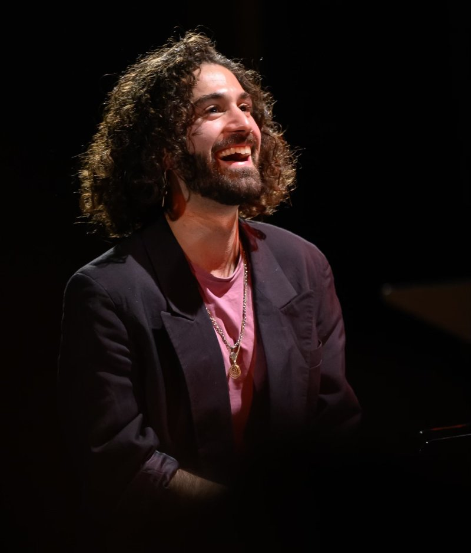
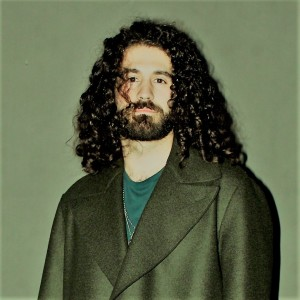
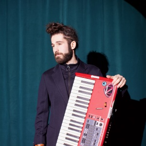
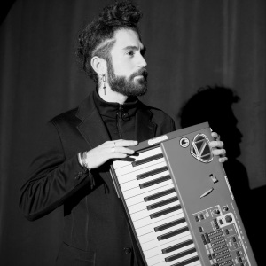
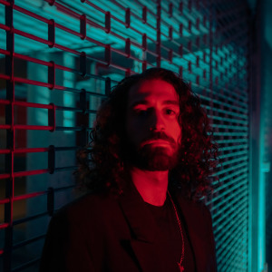
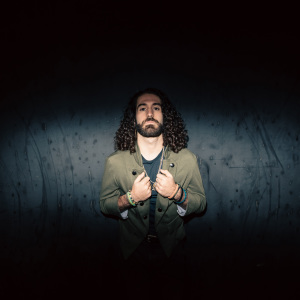
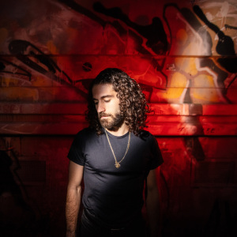

Stellen Sie sich vor, Thom Yorke, der Frontmann von Radiohead, hätte Klavierunterricht bei Bach und Brad Mehldau genommen und würde dann über Minimal Music mit Pharoah Sanders improvisieren – das ist eine der vielen Möglichkeiten, wie man die Musik von Martín Zamorano beschreiben könnte.

Martín Zamorano (\*1995, Madrid) ist ein in Hamburg lebender Pianist, Komponist und Musikpädagoge. Seine klangliche Identität ist geprägt von einem genreübergreifenden Ansatz, der seine klassischen Wurzeln mit Jazztradition, Popkultur, Folk und freier Improvisation verbindet. In seiner Musik verschmelzen Mehrstimmigkeit, Groove und melancholischer Melodik zu einer eigenständigen musikalischen Sprache – stets auf der Suche nach emotionaler Tiefe und künstlerischer Integrität.

Nach einer klassischen Klavierausbildung am Konservatorium Arturo Soria in Madrid studierte er Komposition (B. Mus.) und Musiktheorie (M. Mus.) an der Hochschule für Musik und Theater Hamburg – gefolgt von einem zweiten Master (Dr. Langner Master) in Jazz Performance & Production, in dem er seine Rollen als Pianist und Improvisator vertiefte. Er ist aktiv in Hamburgs Musikszene – von popnahen Projekten mit FiNDiNG CLEO und seinem Folkduo Zamorano&Stamer bis hin zu avantgardistischer Improvisation im Jazzquartett WARMBLUETIG oder im SPIIC-Ensemble unter der Leitung von Vlatko Kucan. Außerdem arbeitet er regelmäßig mit Künstler:innen wie Asya Fateyeva, Barry Guy oder Moritz Baumgärtner zusammen. 2023 gründete er das ECOllective Ensemble, seit 2024 ist er Mitinitiator des experimentellen Labels Mental Pocus Records.

Zamoranos Musik wurde auf Festivals wie Elbjazz, FOLKBaltica, dem Bachfest Hamburg und dem Festival für Alte Musik Köln präsentiert. Seine Auszeichnungen umfassen u. a. den Preis beim Kompositionswettbewerb der Oper Leipzig (2019), die Teilnahme am Genre‑Fluid Composers Lab (New Amsterdam, NY, 2020) und den DAAD-Preis für internationale Studierende (2021). In der Spielzeit 2025/26 arbeitet er erstmals mit dem Deutschen SchauSpielHaus Hamburg – für die Produktion Vampire’s Mountain von Philippe Quesne.

Seit 2021 lehrt er Musiktheorie an der Hochschule für Musik Lübeck, seit 2023 unterrichtet er Klavier für Popularmusik an der Staatlichen Jugendmusikschule Hamburg. Seine pädagogische Arbeit verknüpft europäische Klassik und Jazztradition mit aktuellen Strömungen – mit dem Ziel, eine fundierte musikalische Zukunft zu gestalten, ohne die Vergangenheit zu ignorieren.

## Current Curriculum + Press Kit

[VITA\_(DEU)\_25\_short\_and\_long.pdf](/system/files/30213/original/VITA_(DEU)_25_short_and_long.pdf?1752012980)
[VITA\_(ENG)\_25\_short\_and\_long.pdf](/system/files/30214/original/VITA_(ENG)_25_short_and_long.pdf?1752012980)
[VITA\_(ESP)\_25\_short\_and\_long.pdf](/system/files/30215/original/VITA_(ESP)_25_short_and_long.pdf?1752012980)
[Foto Zamorano 1 (Credit: Alan Finlay)](/system/files/25417/original/K%C3%BCnstlerfoto_1_(3).JPG?1695377151)
[Foto Zamorano 2 (Credit: Alan Finlay)](/system/files/25418/original/Martin_sel_-_9_of_21.jpg?1695377154)
[Foto Zamorano 3 (Credit: Alan Finlay)](/system/files/25419/original/Martin_sel_-_10_of_21_(2).tiff?1695377162)
[Foto Zamorano 4 (Credit: Alan Finlay)](/system/files/25420/original/Martin_sel_-_10_of_21_(niedrieger_aufl%C3%B6sung).png?1695377163)
[Foto Zamorano 5 (Palatinus)](/system/files/27022/original/IMG_3796.jpg?1706900634)

[Alle Dateien herunterladen (ZIP-Archiv)](/pages/vita/sections/378054/download_zip)